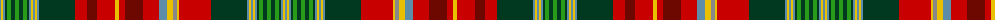

The parent of this is [Beaverbrook (District)](/tartans/b/2/y2/b2/dg2/g4/dg4/g4/dg4/g4/dg2/b2/y2/b2/y2/b2/dg36/r12/dr10/r18/y4/r6/dr18/r16/b8/y6/n4/y2/r32/dg36/b2/y2/b2/y2/b2/dg2/g4/dg4/g4/dg4/g4/dg2/b2/y2/b2/y2/b2/dg2/g4/dg4/g4/dg4/g4/dg2/b2/y2/b2/y2/b2/dg36/r32/y2/n4/y6/b8/r16/dr18/r6/y4/r18/dr10/r12/dg36/b2/y2/b2/y2/b2/dg2/g4/dg4/g/4/)

This was sourced from tartans-authority.  It is a [81 stripes tartan](/stripes/stripes81/).

Original link http://www.tartansauthority.com/tartan-ferret/display/663/

## Thread count
B/2 Y2 B2 DG2 G4 DG4 G4 DG4 G4 DG2 B2 Y2 B2 Y2 B2 DG36 R12 DR10 R18 Y4 R6 DR18 R16 B8 Y6 N4 Y2 R32 DG36 B2 Y2 B2 Y2 B2 DG2 G4 DG4 G4 DG4 G4 DG2 B2 Y2 B2 Y2 B2 DG2 G4 DG4 G4 DG4 G4 DG2 B2 Y2 B2 Y2 B2 DG36 R32 Y2 N4 Y6 B8 R16 DR18 R6 Y4 R18 DR10 R12 DG36 B2 Y2 B2 Y2 B2 DG2 G4 DG4 G/4

## Palette
Each colour and its ΔE from the base-6 reference it is a variant of.

| Colour | Shade | Base | ΔE (OKLab) |
|---|---|---|---|
| B |  `#5C8CA8` | B  | 0.23 |
| DG |  `#003820` | G  | 0.16 |
| DR |  `#6C0800` | R  | 0.20 |
| G |  `#289C18` | G  | 0.18 |
| N |  `#888888` | R  | 0.24 |
| R |  `#C80000` | R  | 0.00 |
| Y |  `#E8C000` | Y  | 0.00 |

ID: /variants/b/2/y2/b2/dg2/g4/dg4/g4/dg4/g4/dg2/b2/y2/b2/y2/b2/dg36/r12/dr10/r18/y4/r6/dr18/r16/b8/y6/n4/y2/r32/dg36/b2/y2/b2/y2/b2/dg2/g4/dg4/g4/dg4/g4/dg2/b2/y2/b2/y2/b2/dg2/g4/dg4/g4/dg4/g4/dg2/b2/y2/b2/y2/b2/dg36/r32/y2/n4/y6/b8/r16/dr18/r6/y4/r18/dr10/r12/dg36/b2/y2/b2/y2/b2/dg2/g4/dg4/g/4-b5c8ca8-dg003820-dr6c0800-g289c18-n888888-rc80000-ye8c000/
