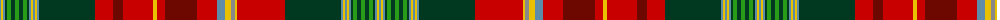

The parent of this is [New Brunswick (Lyon Court Books)](/tartans/b/2/y2/b2/dg2/g4/dg4/g4/dg4/g4/dg2/b2/y2/b2/y2/b2/dg56/r18/dr10/r30/y4/r8/dr32/r20/b8/y6/n4/y2/r48/dg56/b2/y2/b2/y2/b2/dg2/g4/dg4/g4/dg4/g4/dg2/b2/y2/b/2/)

This was sourced from register-of-tartans.  It is a [44 stripes tartan](/stripes/stripes44/).

Original link https://www.tartanregister.gov.uk/tartanDetails.aspx?ref=238

## Thread count
B/2 Y2 B2 DG2 G4 DG4 G4 DG4 G4 DG2 B2 Y2 B2 Y2 B2 DG56 R18 DR10 R30 Y4 R8 DR32 R20 B8 Y6 N4 Y2 R48 DG56 B2 Y2 B2 Y2 B2 DG2 G4 DG4 G4 DG4 G4 DG2 B2 Y2 B/2

## Palette
Each colour and its ΔE from the base-6 reference it is a variant of.

| Colour | Shade | Base | ΔE (OKLab) |
|---|---|---|---|
| B |  `#5C8CA8` | B  | 0.23 |
| DG |  `#003820` | G  | 0.16 |
| DR |  `#6C0800` | R  | 0.20 |
| G |  `#289C18` | G  | 0.18 |
| N |  `#888888` | R  | 0.24 |
| R |  `#C80000` | R  | 0.00 |
| Y |  `#E8C000` | Y  | 0.00 |

ID: /variants/b/2/y2/b2/dg2/g4/dg4/g4/dg4/g4/dg2/b2/y2/b2/y2/b2/dg56/r18/dr10/r30/y4/r8/dr32/r20/b8/y6/n4/y2/r48/dg56/b2/y2/b2/y2/b2/dg2/g4/dg4/g4/dg4/g4/dg2/b2/y2/b/2-b5c8ca8-dg003820-dr6c0800-g289c18-n888888-rc80000-ye8c000/
