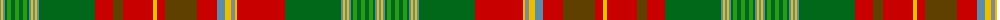

The parent of this is [New Brunswick](/tartans/b/2/y2/b2/g2/ga4/g4/ga4/g4/ga4/g2/b2/y2/b2/y2/b2/g56/r18/t10/r30/y4/r8/t32/r20/b8/y6/n4/y2/r48/g56/b2/y2/b2/y2/b2/g2/ga4/g4/ga4/g4/ga4/g2/b2/y2/b/2/)

This was sourced from register-of-tartans.  It is a [44 stripes tartan](/stripes/stripes44/).

Original link https://www.tartanregister.gov.uk/tartanDetails.aspx?ref=3110

## Thread count
B/2 Y2 B2 G2 Ga4 G4 Ga4 G4 Ga4 G2 B2 Y2 B2 Y2 B2 G56 R18 T10 R30 Y4 R8 T32 R20 B8 Y6 N4 Y2 R48 G56 B2 Y2 B2 Y2 B2 G2 Ga4 G4 Ga4 G4 Ga4 G2 B2 Y2 B/2

## Palette
Each colour and its ΔE from the base-6 reference it is a variant of.

| Colour | Shade | Base | ΔE (OKLab) |
|---|---|---|---|
| B |  `#5C8CA8` | B  | 0.23 |
| G |  `#006818` | G  | 0.02 |
| Ga |  `#289C18` | G  | 0.18 |
| N |  `#888888` | R  | 0.24 |
| R |  `#C80000` | R  | 0.00 |
| T |  `#604000` | G  | 0.14 |
| Y |  `#E8C000` | Y  | 0.00 |

ID: /variants/b/2/y2/b2/g2/ga4/g4/ga4/g4/ga4/g2/b2/y2/b2/y2/b2/g56/r18/t10/r30/y4/r8/t32/r20/b8/y6/n4/y2/r48/g56/b2/y2/b2/y2/b2/g2/ga4/g4/ga4/g4/ga4/g2/b2/y2/b/2-b5c8ca8-g006818-ga289c18-n888888-rc80000-t604000-ye8c000/
