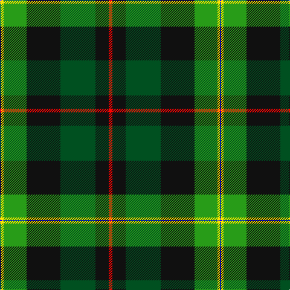

The parent of this is [PMMC](/tartans/b/2/y4/g38/k56/ga58/k22/r/6/)

This was sourced from register-of-tartans.  It is a [7 stripes tartan](/stripes/stripes7/).

Original link https://www.tartanregister.gov.uk/tartanDetails.aspx?ref=11051

## Thread count
B/2 Y4 G38 K56 Ga58 K22 R/6

## Palette
Each colour and its ΔE from the base-6 reference it is a variant of.

| Colour | Shade | Base | ΔE (OKLab) |
|---|---|---|---|
| B |  `#0000FF` | B  | 0.21 |
| G |  `#289C18` | G  | 0.18 |
| Ga |  `#005020` | G  | 0.08 |
| K |  `#101010` | K  | 0.17 |
| R |  `#FF0000` | R  | 0.11 |
| Y |  `#FFE600` | Y  | 0.10 |

# Sample pattern

ID: /variants/b/2/y4/g38/k56/ga58/k22/r/6-b0000ff-g289c18-ga005020-k101010-rff0000-yffe600/
