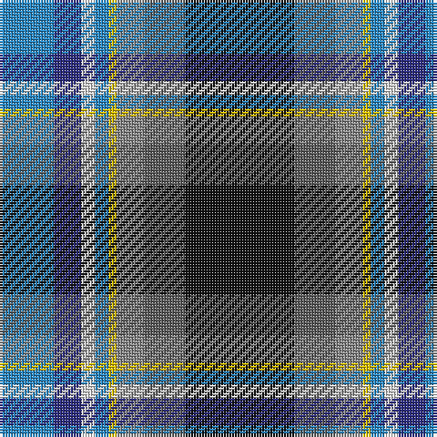

The parent of this is [Julien Pigeut Tartan Tartan Number: 6574. Earliest known date: 2004 For the wedding of Julien and Sylvia Piguet. Also worn by Roland Mathez best man of Julien. See products available Copyright © Blair Urquhart, Comrie, 2015](/tartans/b/20/db10/ln5/b5/y3/na10/n15/k/40/)

This was sourced from house-of-tartan.  It is a [8 stripes tartan](/stripes/stripes8/).

Original link http://www.house-of-tartan.scotland.net/house/TartanViewjs.asp?colr=Def&tnam=6574

## Thread count
B/20 DB10 LN5 B5 Y3 Na10 N15 K/40

## Palette
Each colour and its ΔE from the base-6 reference it is a variant of.

| Colour | Shade | Base | ΔE (OKLab) |
|---|---|---|---|
| B |  `#2888C4` | B  | 0.21 |
| DB |  `#2C2C80` | B  | 0.05 |
| K |  `#101010` | K  | 0.17 |
| LN |  `#E0E0E0` | W  | 0.06 |
| N |  `#5C5C5C` | B  | 0.14 |
| Na |  `#888888` | R  | 0.24 |
| Y |  `#E8C000` | Y  | 0.00 |

# Sample pattern

ID: /variants/b/20/db10/ln5/b5/y3/na10/n15/k/40-b2888c4-db2c2c80-k101010-lne0e0e0-n5c5c5c-na888888-ye8c000/
