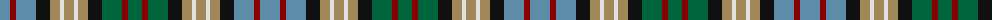

The parent of this is [Redgate (Name)](/tartans/b/20/dr6/b20/k14/lt10/ln4/lt10/ln4/lt10/k14/g20/dr6/g/14/)

This was sourced from tartans-authority.  It is a [13 stripes tartan](/stripes/stripes13/).

Original link http://www.tartansauthority.com/tartan-ferret/display/10775/

## Thread count
B/20 DR6 B20 K14 LT10 LN4 LT10 LN4 LT10 K14 G20 DR6 G/14

## Palette
Each colour and its ΔE from the base-6 reference it is a variant of.

| Colour | Shade | Base | ΔE (OKLab) |
|---|---|---|---|
| B |  `#5C8CA8` | B  | 0.23 |
| DR |  `#880000` | R  | 0.14 |
| G |  `#00643C` | G  | 0.06 |
| K |  `#101010` | K  | 0.17 |
| LN |  `#E0E0E0` | W  | 0.06 |
| LT |  `#A08858` | Y  | 0.21 |

ID: /variants/b/20/dr6/b20/k14/lt10/ln4/lt10/ln4/lt10/k14/g20/dr6/g/14-b5c8ca8-dr880000-g00643c-k101010-lne0e0e0-lta08858/
