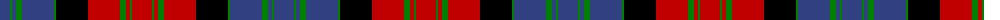

The parent of this is [MacInroy](/tartans/b/20/g2/b4/g6/b32/g2/k32/r32/g6/r4/g2/r/20/)

This was sourced from weddslist.  It is a [12 stripes tartan](/stripes/stripes12/).

Original link http://www.weddslist.com/cgi-bin/tartans/pg.pl?source=sts

## Thread count
B/20 G2 B4 G6 B32 G2 K32 R32 G6 R4 G2 R/20

## Palette
Each colour and its ΔE from the base-6 reference it is a variant of.

| Colour | Shade | Base | ΔE (OKLab) |
|---|---|---|---|
| B |  `#304080` | B  | 0.01 |
| G |  `#008000` | G  | 0.09 |
| K |  `#000000` | K  | 0.00 |
| R |  `#C00000` | R  | 0.02 |

ID: /variants/b/20/g2/b4/g6/b32/g2/k32/r32/g6/r4/g2/r/20-b304080-g008000-k000000-rc00000/
