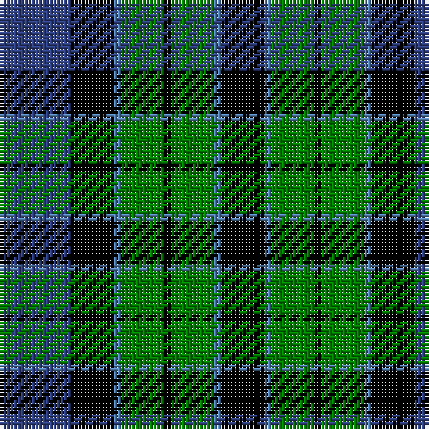

The parent of this is [Unnamed, No 115](/tartans/b/20/k12/ba2/g12/k2/g12/ba2/k/12/)

This was sourced from weddslist.  It is a [8 stripes tartan](/stripes/stripes8/).

Original link http://www.weddslist.com/cgi-bin/tartans/pg.pl?source=sts

## Thread count
B/20 K12 Ba2 G12 K2 G12 Ba2 K/12

## Palette
Each colour and its ΔE from the base-6 reference it is a variant of.

| Colour | Shade | Base | ΔE (OKLab) |
|---|---|---|---|
| B |  `#304080` | B  | 0.01 |
| Ba |  `#5480B0` | B  | 0.20 |
| G |  `#008000` | G  | 0.09 |
| K |  `#000000` | K  | 0.00 |

# Sample pattern

ID: /variants/b/20/k12/ba2/g12/k2/g12/ba2/k/12-b304080-ba5480b0-g008000-k000000/
