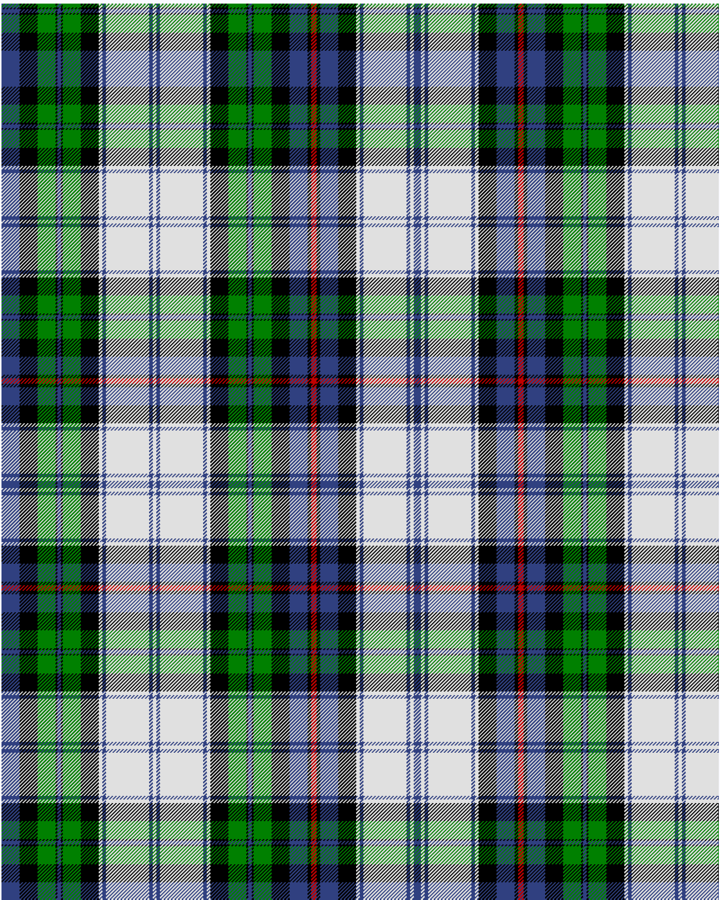

Campbell of Cawdor, dress

This was sourced from <no value>.  It is a 36 stripes tartan.

Original link http://www.weddslist.com/cgi-bin/tartans/pg.pl?source=sts

## Thread count
B/20 K20 G20 K2 B4 K2 G20 K20 LN4 B4 LN48 B4 LN4 B4 LN48 B4 LN4 K20 G20 K2 B4 K2 G20 K20 B20 K4 R6 K4 B20 K20 LN4 B4 LN48 B4 LN4 B/4

## Palette
B#304080 G#008000 K#000000 LN#E0E0E0 R#C00000

# Sample pattern

ID: /variants/b/20/k20/g20/k2/b4/k2/g20/k20/ln4/b4/ln48/b4/ln4/b4/ln48/b4/ln4/k20/g20/k2/b4/k2/g20/k20/b20/k4/r6/k4/b20/k20/ln4/b4/ln48/b4/ln4/b/4-b304080-g008000-k000000-lne0e0e0-rc00000