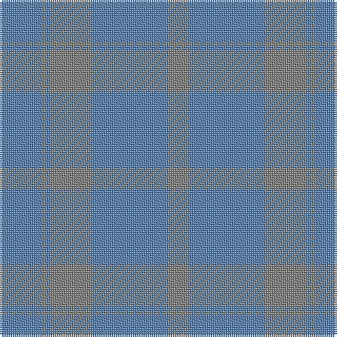

The parent of this is [Harmony, No 13](/tartans/b/20/n2/b2/n20/b36/n/10/)

This was sourced from weddslist.  It is a [6 stripes tartan](/stripes/stripes6/).

Original link http://www.weddslist.com/cgi-bin/tartans/pg.pl?source=sts

## Thread count
B/20 N2 B2 N20 B36 N/10

## Palette
Each colour and its ΔE from the base-6 reference it is a variant of.

| Colour | Shade | Base | ΔE (OKLab) |
|---|---|---|---|
| B |  `#5480B0` | B  | 0.20 |
| N |  `#808080` | G  | 0.22 |

# Sample pattern

ID: /variants/b/20/n2/b2/n20/b36/n/10-b5480b0-n808080/
