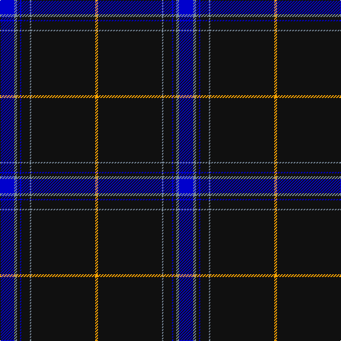

The parent of this is [Marine Harvest (Scotland)](/tartans/b/20/n4/k4/b2/k12/n2/k90/y/4/)

This was sourced from register-of-tartans.  It is a [8 stripes tartan](/stripes/stripes8/).

Original link https://www.tartanregister.gov.uk/tartanDetails.aspx?ref=10382

## Thread count
B/20 N4 K4 B2 K12 N2 K90 Y/4

## Palette
Each colour and its ΔE from the base-6 reference it is a variant of.

| Colour | Shade | Base | ΔE (OKLab) |
|---|---|---|---|
| B |  `#0000CD` | B  | 0.15 |
| K |  `#101010` | K  | 0.17 |
| N |  `#778899` | B  | 0.24 |
| Y |  `#FFA500` | Y  | 0.07 |

# Sample pattern

ID: /variants/b/20/n4/k4/b2/k12/n2/k90/y/4-b0000cd-k101010-n778899-yffa500/
