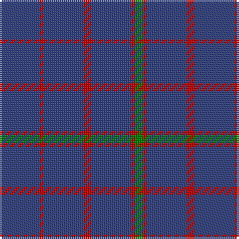

The parent of this is [Hebridean, (Old..)](/tartans/b/20/r2/b20/r4/b20/r2/g/4/)

This was sourced from weddslist.  It is a [7 stripes tartan](/stripes/stripes7/).

Original link http://www.weddslist.com/cgi-bin/tartans/pg.pl?source=sts

## Thread count
B/20 R2 B20 R4 B20 R2 G/4

## Palette
Each colour and its ΔE from the base-6 reference it is a variant of.

| Colour | Shade | Base | ΔE (OKLab) |
|---|---|---|---|
| B |  `#304080` | B  | 0.01 |
| G |  `#008000` | G  | 0.09 |
| R |  `#C00000` | R  | 0.02 |

# Sample pattern

ID: /variants/b/20/r2/b20/r4/b20/r2/g/4-b304080-g008000-rc00000/
