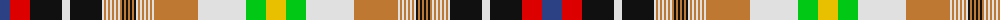

The parent of this is [All breeds Dairy Goats (Version 2)](/tartans/b/20/r20/k32/ln8/k32/ln2/do2/ln2/do2/ln2/do2/ln2/do2/ln2/do2/k2/do2/k2/do2/k2/do2/k2/ln2/do2/ln2/do2/ln2/do2/ln2/do2/ln2/do44/ln48/g20/y/20/)

This was sourced from register-of-tartans.  It is a [35 stripes tartan](/stripes/stripes35/).

Original link https://www.tartanregister.gov.uk/tartanDetails.aspx?ref=5943

## Thread count
B/20 R20 K32 LN8 K32 LN2 DO2 LN2 DO2 LN2 DO2 LN2 DO2 LN2 DO2 K2 DO2 K2 DO2 K2 DO2 K2 LN2 DO2 LN2 DO2 LN2 DO2 LN2 DO2 LN2 DO44 LN48 G20 Y/20

## Palette
Each colour and its ΔE from the base-6 reference it is a variant of.

| Colour | Shade | Base | ΔE (OKLab) |
|---|---|---|---|
| B |  `#2C4084` | B  | 0.00 |
| DO |  `#BE7832` | R  | 0.17 |
| G |  `#00C814` | Y  | 0.21 |
| K |  `#101010` | K  | 0.17 |
| LN |  `#E0E0E0` | W  | 0.06 |
| R |  `#DC0000` | R  | 0.04 |
| Y |  `#E8C000` | Y  | 0.00 |

ID: /variants/b/20/r20/k32/ln8/k32/ln2/do2/ln2/do2/ln2/do2/ln2/do2/ln2/do2/k2/do2/k2/do2/k2/do2/k2/ln2/do2/ln2/do2/ln2/do2/ln2/do2/ln2/do44/ln48/g20/y/20-b2c4084-dobe7832-g00c814-k101010-lne0e0e0-rdc0000-ye8c000/
