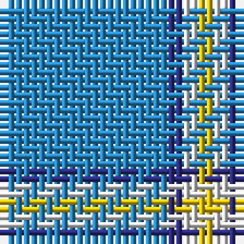

The parent of this is [Varrie Name Tartan Tartan Number: 10113. Earliest known date: 20th Nov. 2009 Designed in remembrance of the designer's mother, Jean Alexander Varrie, and her Scottish heritage. The light blue represents the rivers crossed by the family, the medium blue represents the oceans crossed, yellow represents the land and mountains where they settled and white represents their peace and tranquility. All Varrie families may use this design. See products available Copyright © Blair Urquhart, Comrie, 2015](/tartans/b/22/db2/ln2/y/2/)

This was sourced from house-of-tartan.  It is a [4 stripes tartan](/stripes/stripes4/).

Original link http://www.house-of-tartan.scotland.net/house/TartanViewjs.asp?colr=Def&tnam=10113

## Thread count
B/22 DB2 LN2 Y/2

## Palette
Each colour and its ΔE from the base-6 reference it is a variant of.

| Colour | Shade | Base | ΔE (OKLab) |
|---|---|---|---|
| B |  `#2888C4` | B  | 0.21 |
| DB |  `#2C2C80` | B  | 0.05 |
| LN |  `#E0E0E0` | W  | 0.06 |
| Y |  `#E8C000` | Y  | 0.00 |

# Sample pattern

ID: /variants/b/22/db2/ln2/y/2-b2888c4-db2c2c80-lne0e0e0-ye8c000/
