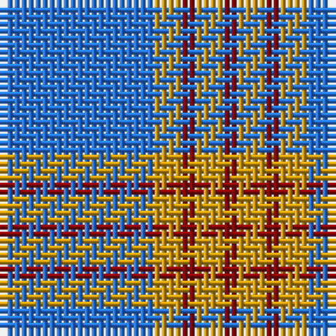

The parent of this is [Carlisle Ancient (Name)](/tartans/b/22/dy4/dr2/dy4/dr/2/)

This was sourced from tartans-authority.  It is a [5 stripes tartan](/stripes/stripes5/).

Original link http://www.tartansauthority.com/tartan-ferret/display/680/

## Thread count
B/22 DY4 DR2 DY4 DR/2

## Palette
Each colour and its ΔE from the base-6 reference it is a variant of.

| Colour | Shade | Base | ΔE (OKLab) |
|---|---|---|---|
| B |  `#2474E8` | B  | 0.20 |
| DR |  `#880000` | R  | 0.14 |
| DY |  `#D09800` | Y  | 0.11 |

# Sample pattern

ID: /variants/b/22/dy4/dr2/dy4/dr/2-b2474e8-dr880000-dyd09800/
