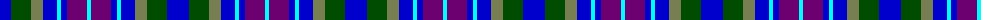

The parent of this is [Hummelt, Katherine (Personal)](/tartans/b/22/g20/ga12/b14/lb4/b6/p20/lb/4/)

This was sourced from register-of-tartans.  It is a [8 stripes tartan](/stripes/stripes8/).

Original link https://www.tartanregister.gov.uk/tartanDetails.aspx?ref=11591

## Thread count
B/22 G20 Ga12 B14 LB4 B6 P20 LB/4

## Palette
Each colour and its ΔE from the base-6 reference it is a variant of.

| Colour | Shade | Base | ΔE (OKLab) |
|---|---|---|---|
| B |  `#0000CD` | B  | 0.15 |
| G |  `#004C00` | G  | 0.08 |
| Ga |  `#767E52` | G  | 0.17 |
| LB |  `#00FCFC` | W  | 0.17 |
| P |  `#6C0070` | B  | 0.15 |

# Sample pattern

ID: /variants/b/22/g20/ga12/b14/lb4/b6/p20/lb/4-b0000cd-g004c00-ga767e52-lb00fcfc-p6c0070/
