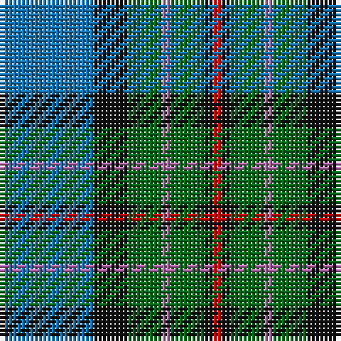

The parent of this is [Ednie (Personal)](/tartans/b/22/k8/g8/p2/g8/k2/r/2/)

This was sourced from tartans-authority.  It is a [7 stripes tartan](/stripes/stripes7/).

Original link http://www.tartansauthority.com/tartan-ferret/display/8511/

## Thread count
B/22 K8 G8 P2 G8 K2 R/2

## Palette
Each colour and its ΔE from the base-6 reference it is a variant of.

| Colour | Shade | Base | ΔE (OKLab) |
|---|---|---|---|
| B |  `#1474B4` | B  | 0.15 |
| G |  `#006818` | G  | 0.02 |
| K |  `#101010` | K  | 0.17 |
| P |  `#B468AC` | R  | 0.21 |
| R |  `#C80000` | R  | 0.00 |

# Sample pattern

ID: /variants/b/22/k8/g8/p2/g8/k2/r/2-b1474b4-g006818-k101010-pb468ac-rc80000/
