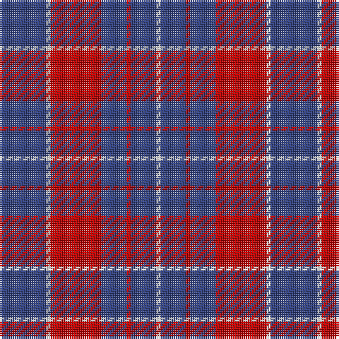

The parent of this is [Coronation](/tartans/b/22/ln2/r24/b12/r2/b12/ln/2/)

This was sourced from weddslist.  It is a [7 stripes tartan](/stripes/stripes7/).

Original link http://www.weddslist.com/cgi-bin/tartans/pg.pl?source=sts

## Thread count
B/22 LN2 R24 B12 R2 B12 LN/2

## Palette
Each colour and its ΔE from the base-6 reference it is a variant of.

| Colour | Shade | Base | ΔE (OKLab) |
|---|---|---|---|
| B |  `#304080` | B  | 0.01 |
| LN |  `#E0E0E0` | W  | 0.06 |
| R |  `#C00000` | R  | 0.02 |

# Sample pattern

ID: /variants/b/22/ln2/r24/b12/r2/b12/ln/2-b304080-lne0e0e0-rc00000/
