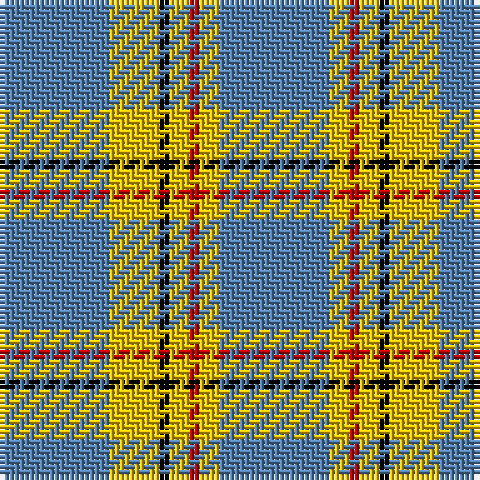

The parent of this is [Carlisle](/tartans/b/22/y10/k2/y4/r2/y4/b/22/)

This was sourced from weddslist.  It is a [7 stripes tartan](/stripes/stripes7/).

Original link http://www.weddslist.com/cgi-bin/tartans/pg.pl?source=sts

## Thread count
B/22 Y10 K2 Y4 R2 Y4 B/22

## Palette
Each colour and its ΔE from the base-6 reference it is a variant of.

| Colour | Shade | Base | ΔE (OKLab) |
|---|---|---|---|
| B |  `#5480B0` | B  | 0.20 |
| K |  `#000000` | K  | 0.00 |
| R |  `#C00000` | R  | 0.02 |
| Y |  `#F0C000` | Y  | 0.01 |

# Sample pattern

ID: /variants/b/22/y10/k2/y4/r2/y4/b/22-b5480b0-k000000-rc00000-yf0c000/
