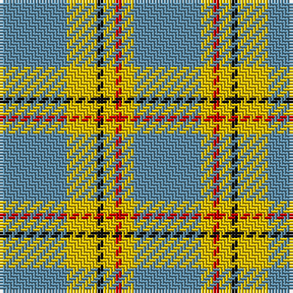

The parent of this is [Carlisle Family Tartan Tartan Number: 674. Earliest known date: 1987 Derived from the Coat of Arms. See products available Copyright © Blair Urquhart, Comrie, 2015](/tartans/b/22/y10/k2/y4/r2/y4/b/22/)

This was sourced from house-of-tartan.  It is a [7 stripes tartan](/stripes/stripes7/).

Original link http://www.house-of-tartan.scotland.net/house/TartanViewjs.asp?colr=Def&tnam=674

## Thread count
B/22 Y10 K2 Y4 R2 Y4 B/22

## Palette
Each colour and its ΔE from the base-6 reference it is a variant of.

| Colour | Shade | Base | ΔE (OKLab) |
|---|---|---|---|
| B |  `#5C8CA8` | B  | 0.23 |
| K |  `#101010` | K  | 0.17 |
| R |  `#C80000` | R  | 0.00 |
| Y |  `#E8C000` | Y  | 0.00 |

# Sample pattern

ID: /variants/b/22/y10/k2/y4/r2/y4/b/22-b5c8ca8-k101010-rc80000-ye8c000/
