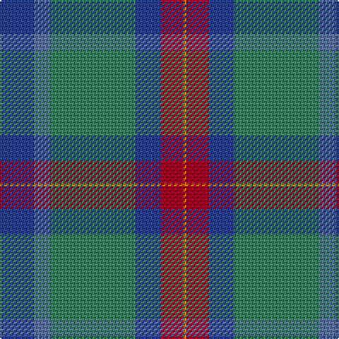

The parent of this is [Wright, Anne (Personal)](/tartans/b/24/ba12/g60/b18/dr16/o/2/)

This was sourced from register-of-tartans.  It is a [6 stripes tartan](/stripes/stripes6/).

Original link https://www.tartanregister.gov.uk/tartanDetails.aspx?ref=11188

## Thread count
B/24 Ba12 G60 B18 DR16 O/2

## Palette
Each colour and its ΔE from the base-6 reference it is a variant of.

| Colour | Shade | Base | ΔE (OKLab) |
|---|---|---|---|
| B |  `#2C4084` | B  | 0.00 |
| Ba |  `#5F749C` | B  | 0.17 |
| DR |  `#960028` | R  | 0.11 |
| G |  `#408060` | G  | 0.13 |
| O |  `#D87C00` | Y  | 0.17 |

# Sample pattern

ID: /variants/b/24/ba12/g60/b18/dr16/o/2-b2c4084-ba5f749c-dr960028-g408060-od87c00/
