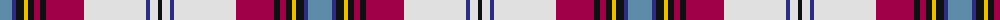

The parent of this is [MacLean Dress Burgundy Clan Tartan Tartan Number: 59. Earliest known date: pre 2003 Dress form of MacLean of Duart. Count taken from a sample in Reproduction colours See products available Copyright © Blair Urquhart, Comrie, 2015](/tartans/b/24/db4/k8/y4/k6/r6/k6/r38/ln62/db4/ln8/k/4/)

This was sourced from house-of-tartan.  It is a [12 stripes tartan](/stripes/stripes12/).

Original link http://www.house-of-tartan.scotland.net/house/TartanViewjs.asp?colr=Def&tnam=59

## Thread count
B/24 DB4 K8 Y4 K6 R6 K6 R38 LN62 DB4 LN8 K/4

## Palette
Each colour and its ΔE from the base-6 reference it is a variant of.

| Colour | Shade | Base | ΔE (OKLab) |
|---|---|---|---|
| B |  `#5C8CA8` | B  | 0.23 |
| DB |  `#2C2C80` | B  | 0.05 |
| K |  `#101010` | K  | 0.17 |
| LN |  `#E0E0E0` | W  | 0.06 |
| R |  `#A00048` | R  | 0.11 |
| Y |  `#E8C000` | Y  | 0.00 |

ID: /variants/b/24/db4/k8/y4/k6/r6/k6/r38/ln62/db4/ln8/k/4-b5c8ca8-db2c2c80-k101010-lne0e0e0-ra00048-ye8c000/
