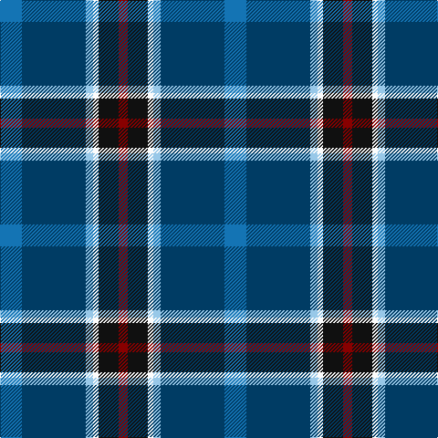

The parent of this is [Ferster, James Carney (Personal)](/tartans/b/24/db70/lb8/w6/k22/dr/10/)

This was sourced from tartans-authority.  It is a [6 stripes tartan](/stripes/stripes6/).

Original link http://www.tartansauthority.com/tartan-ferret/display/10595/

## Thread count
B/24 DB70 LB8 W6 K22 DR/10

## Palette
Each colour and its ΔE from the base-6 reference it is a variant of.

| Colour | Shade | Base | ΔE (OKLab) |
|---|---|---|---|
| B |  `#1474B4` | B  | 0.15 |
| DB |  `#003C64` | B  | 0.07 |
| DR |  `#880000` | R  | 0.14 |
| K |  `#101010` | K  | 0.17 |
| LB |  `#98C8E8` | W  | 0.17 |
| W |  `#FCFCFC` | W  | 0.03 |

# Sample pattern

ID: /variants/b/24/db70/lb8/w6/k22/dr/10-b1474b4-db003c64-dr880000-k101010-lb98c8e8-wfcfcfc/
