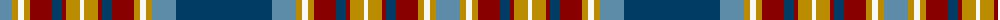

The parent of this is [Holyrood Golden Jubilee II](/tartans/b/24/dy6/w6/dy6/dr22/db10/dr4/dy14/w4/dy14/dr4/db10/dr22/dy6/w6/dy6/b24/db/96/)

This was sourced from register-of-tartans.  It is a [18 stripes tartan](/stripes/stripes18/).

Original link https://www.tartanregister.gov.uk/tartanDetails.aspx?ref=1756

## Thread count
B/24 DY6 W6 DY6 DR22 DB10 DR4 DY14 W4 DY14 DR4 DB10 DR22 DY6 W6 DY6 B24 DB/96

## Palette
Each colour and its ΔE from the base-6 reference it is a variant of.

| Colour | Shade | Base | ΔE (OKLab) |
|---|---|---|---|
| B |  `#5C8CA8` | B  | 0.23 |
| Ba |  `#1870A4` | B  | 0.14 |
| DB |  `#003C64` | B  | 0.07 |
| DR |  `#880000` | R  | 0.14 |
| DY |  `#BC8C00` | Y  | 0.16 |
| W |  `#F8F8F8` | W  | 0.01 |

ID: /variants/b/24/dy6/w6/dy6/dr22/db10/dr4/dy14/w4/dy14/dr4/db10/dr22/dy6/w6/dy6/b24/db/96-b5c8ca8-ba1870a4-db003c64-dr880000-dybc8c00-wf8f8f8/
