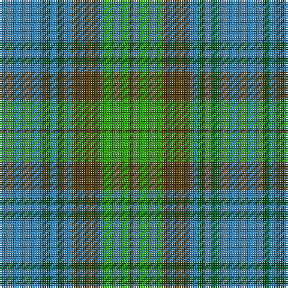

The parent of this is [Universal Ancient](/tartans/b/24/g4/b4/g4/b4/t16/ga16/t/2/)

This was sourced from register-of-tartans.  It is a [8 stripes tartan](/stripes/stripes8/).

Original link https://www.tartanregister.gov.uk/tartanDetails.aspx?ref=4401

## Thread count
B/24 G4 B4 G4 B4 T16 Ga16 T/2

## Palette
Each colour and its ΔE from the base-6 reference it is a variant of.

| Colour | Shade | Base | ΔE (OKLab) |
|---|---|---|---|
| B |  `#3C82AF` | B  | 0.20 |
| G |  `#005020` | G  | 0.08 |
| Ga |  `#309C18` | G  | 0.18 |
| T |  `#503C14` | G  | 0.15 |

# Sample pattern

ID: /variants/b/24/g4/b4/g4/b4/t16/ga16/t/2-b3c82af-g005020-ga309c18-t503c14/
