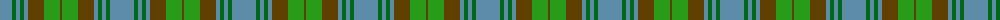

The parent of this is [Universal Ancient International Tartan Tartan Number: 136. Earliest known date: Canada This design is different in warp and weft. The display gives the general appearance only. Produced to celebrate American tourism is Scotland. The colours are taken from the flags of the two nations and the Atlantic Ocean that separates them. See products available Copyright © Blair Urquhart, Comrie, 2015](/tartans/b/24/g4/b4/g4/b4/t16/ga16/t/2/)

This was sourced from house-of-tartan.  It is a [8 stripes tartan](/stripes/stripes8/).

Original link http://www.house-of-tartan.scotland.net/house/TartanViewjs.asp?colr=Def&tnam=136

## Thread count
B/24 G4 B4 G4 B4 T16 Ga16 T/2

## Palette
Each colour and its ΔE from the base-6 reference it is a variant of.

| Colour | Shade | Base | ΔE (OKLab) |
|---|---|---|---|
| B |  `#5C8CA8` | B  | 0.23 |
| G |  `#006818` | G  | 0.02 |
| Ga |  `#289C18` | G  | 0.18 |
| T |  `#604000` | G  | 0.14 |

# Sample pattern

ID: /variants/b/24/g4/b4/g4/b4/t16/ga16/t/2-b5c8ca8-g006818-ga289c18-t604000/
