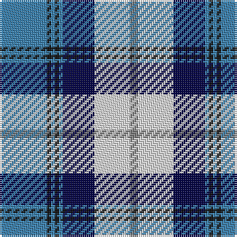

The parent of this is [Arran (Pendleton)](/tartans/b/24/k2/b2/k2/b2/db16/ln18/n/4/)

This was sourced from register-of-tartans.  It is a [8 stripes tartan](/stripes/stripes8/).

Original link https://www.tartanregister.gov.uk/tartanDetails.aspx?ref=117

## Thread count
B/24 K2 B2 K2 B2 DB16 LN18 N/4

## Palette
Each colour and its ΔE from the base-6 reference it is a variant of.

| Colour | Shade | Base | ΔE (OKLab) |
|---|---|---|---|
| B |  `#3C82AF` | B  | 0.20 |
| DB |  `#080848` | B  | 0.19 |
| K |  `#101010` | K  | 0.17 |
| LN |  `#E0E0E0` | W  | 0.06 |
| N |  `#808080` | G  | 0.22 |

# Sample pattern

ID: /variants/b/24/k2/b2/k2/b2/db16/ln18/n/4-b3c82af-db080848-k101010-lne0e0e0-n808080/
