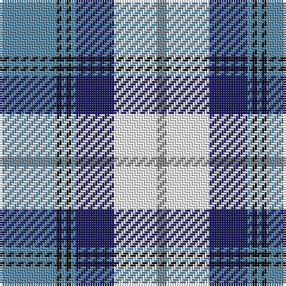

The parent of this is [Arran - 1989 (Fashion)](/tartans/b/24/k2/b2/k2/b2/db16/w18/n/4/)

This was sourced from tartans-authority.  It is a [8 stripes tartan](/stripes/stripes8/).

Original link http://www.tartansauthority.com/tartan-ferret/display/261/

## Thread count
B/24 K2 B2 K2 B2 DB16 W18 N/4

## Palette
Each colour and its ΔE from the base-6 reference it is a variant of.

| Colour | Shade | Base | ΔE (OKLab) |
|---|---|---|---|
| B |  `#5C8CA8` | B  | 0.23 |
| DB |  `#202060` | B  | 0.11 |
| K |  `#101010` | K  | 0.17 |
| N |  `#888888` | R  | 0.24 |
| W |  `#FCFCFC` | W  | 0.03 |

# Sample pattern

ID: /variants/b/24/k2/b2/k2/b2/db16/w18/n/4-b5c8ca8-db202060-k101010-n888888-wfcfcfc/
