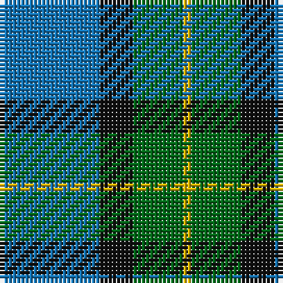

The parent of this is [Sinclair of Ulbster (Portrait)](/tartans/b/24/k8/g12/y/2/)

This was sourced from tartans-authority.  It is a [4 stripes tartan](/stripes/stripes4/).

Original link http://www.tartansauthority.com/tartan-ferret/display/339/

## Thread count
B/24 K8 G12 Y/2

## Palette
Each colour and its ΔE from the base-6 reference it is a variant of.

| Colour | Shade | Base | ΔE (OKLab) |
|---|---|---|---|
| B |  `#1474B4` | B  | 0.15 |
| G |  `#006818` | G  | 0.02 |
| K |  `#101010` | K  | 0.17 |
| Y |  `#D8B000` | Y  | 0.05 |

# Sample pattern

ID: /variants/b/24/k8/g12/y/2-b1474b4-g006818-k101010-yd8b000/
