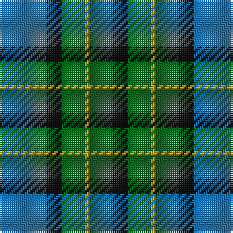

The parent of this is [Sinclair of Ulbster](/tartans/b/24/k8/g12/y2/g12/k/8/)

This was sourced from register-of-tartans.  It is a [6 stripes tartan](/stripes/stripes6/).

Original link https://www.tartanregister.gov.uk/tartanDetails.aspx?ref=3798

## Thread count
B/24 K8 G12 Y2 G12 K/8

## Palette
Each colour and its ΔE from the base-6 reference it is a variant of.

| Colour | Shade | Base | ΔE (OKLab) |
|---|---|---|---|
| B |  `#1474B4` | B  | 0.15 |
| DB |  `#202060` | B  | 0.11 |
| DBa |  `#2C2C80` | B  | 0.05 |
| DG |  `#003820` | G  | 0.16 |
| G |  `#006818` | G  | 0.02 |
| K |  `#101010` | K  | 0.17 |
| Y |  `#D8B000` | Y  | 0.05 |

# Sample pattern

ID: /variants/b/24/k8/g12/y2/g12/k/8-b1474b4-db202060-dba2c2c80-dg003820-g006818-k101010-yd8b000/
