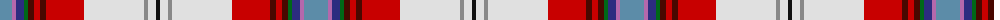

The parent of this is [MacLean of Duart Dress Clan Tartan Tartan Number: 573. Earliest known date: pre 2003 White and Yellow are in silk. See products available Copyright © Blair Urquhart, Comrie, 2015](/tartans/b/24/p4/db8/g4/dr6/r6/dr6/r38/ln60/n4/ln8/k/4/)

This was sourced from house-of-tartan.  It is a [12 stripes tartan](/stripes/stripes12/).

Original link http://www.house-of-tartan.scotland.net/house/TartanViewjs.asp?colr=Def&tnam=573

## Thread count
B/24 P4 DB8 G4 DR6 R6 DR6 R38 LN60 N4 LN8 K/4

## Palette
Each colour and its ΔE from the base-6 reference it is a variant of.

| Colour | Shade | Base | ΔE (OKLab) |
|---|---|---|---|
| B |  `#5C8CA8` | B  | 0.23 |
| DB |  `#2C2C80` | B  | 0.05 |
| DR |  `#480800` | B  | 0.23 |
| G |  `#006818` | G  | 0.02 |
| K |  `#101010` | K  | 0.17 |
| LN |  `#E0E0E0` | W  | 0.06 |
| N |  `#888888` | R  | 0.24 |
| P |  `#B468AC` | R  | 0.21 |
| R |  `#C80000` | R  | 0.00 |

ID: /variants/b/24/p4/db8/g4/dr6/r6/dr6/r38/ln60/n4/ln8/k/4-b5c8ca8-db2c2c80-dr480800-g006818-k101010-lne0e0e0-n888888-pb468ac-rc80000/
