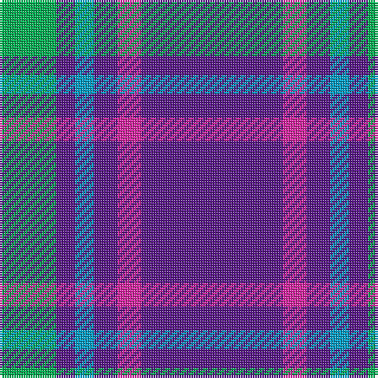

The parent of this is [International Festival of Authors](/tartans/b/24/p8/ba8/p10/lr10/p/60/)

This was sourced from register-of-tartans.  It is a [6 stripes tartan](/stripes/stripes6/).

Original link https://www.tartanregister.gov.uk/tartanDetails.aspx?ref=10057

## Thread count
B/24 P8 Ba8 P10 LR10 P/60

## Palette
Each colour and its ΔE from the base-6 reference it is a variant of.

| Colour | Shade | Base | ΔE (OKLab) |
|---|---|---|---|
| B |  `#00B052` | Y  | 0.23 |
| Ba |  `#009EC7` | B  | 0.27 |
| LR |  `#E026A3` | R  | 0.19 |
| P |  `#59178A` | B  | 0.11 |

# Sample pattern

ID: /variants/b/24/p8/ba8/p10/lr10/p/60-b00b052-ba009ec7-lre026a3-p59178a/
