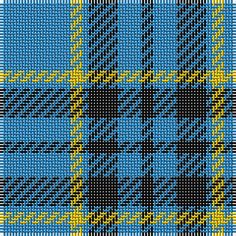

The parent of this is [Rea (Name)](/tartans/b/24/y4/b2/k10/b8/k/4/)

This was sourced from tartans-authority.  It is a [6 stripes tartan](/stripes/stripes6/).

Original link http://www.tartansauthority.com/tartan-ferret/display/6613/

## Thread count
B/24 Y4 B2 K10 B8 K/4

## Palette
Each colour and its ΔE from the base-6 reference it is a variant of.

| Colour | Shade | Base | ΔE (OKLab) |
|---|---|---|---|
| B |  `#2888C4` | B  | 0.21 |
| K |  `#101010` | K  | 0.17 |
| Y |  `#E8C000` | Y  | 0.00 |

# Sample pattern

ID: /variants/b/24/y4/b2/k10/b8/k/4-b2888c4-k101010-ye8c000/
