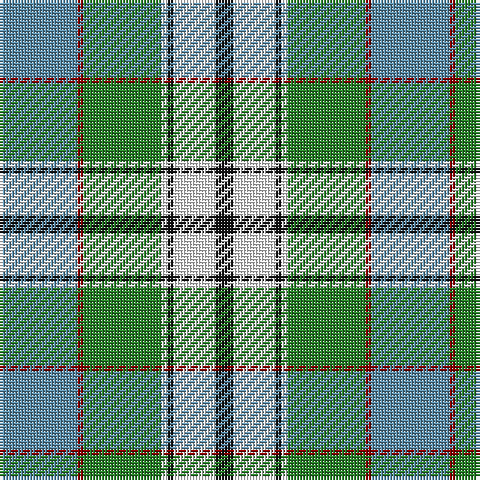

The parent of this is [Chambers, Christopher J (Personal)](/tartans/b/26/dr2/g26/w2/k2/w14/k/6/)

This was sourced from tartans-authority.  It is a [7 stripes tartan](/stripes/stripes7/).

Original link http://www.tartansauthority.com/tartan-ferret/display/10570/

## Thread count
B/26 DR2 G26 W2 K2 W14 K/6

## Palette
Each colour and its ΔE from the base-6 reference it is a variant of.

| Colour | Shade | Base | ΔE (OKLab) |
|---|---|---|---|
| B |  `#5C8CA8` | B  | 0.23 |
| DR |  `#880000` | R  | 0.14 |
| G |  `#288028` | G  | 0.09 |
| K |  `#101010` | K  | 0.17 |
| W |  `#FCFCFC` | W  | 0.03 |

# Sample pattern

ID: /variants/b/26/dr2/g26/w2/k2/w14/k/6-b5c8ca8-dr880000-g288028-k101010-wfcfcfc/
