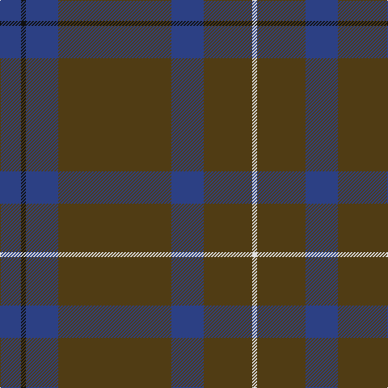

The parent of this is [Unidentified #44](/tartans/b/26/k6/b40/t140/b40/t60/ln/6/)

This was sourced from register-of-tartans.  It is a [7 stripes tartan](/stripes/stripes7/).

Original link https://www.tartanregister.gov.uk/tartanDetails.aspx?ref=4245

## Thread count
B/26 K6 B40 T140 B40 T60 LN/6

## Palette
Each colour and its ΔE from the base-6 reference it is a variant of.

| Colour | Shade | Base | ΔE (OKLab) |
|---|---|---|---|
| B |  `#2C4084` | B  | 0.00 |
| K |  `#101010` | K  | 0.17 |
| LN |  `#E0E0E0` | W  | 0.06 |
| T |  `#503C14` | G  | 0.15 |

# Sample pattern

ID: /variants/b/26/k6/b40/t140/b40/t60/ln/6-b2c4084-k101010-lne0e0e0-t503c14/
