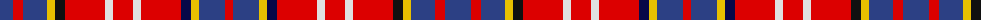

The parent of this is [Ogilvie #2](/tartans/b/26/r10/b24/y8/k10/r40/ln8/r20/ln8/r40/db10/y8/b26/r/8/)

This was sourced from register-of-tartans.  It is a [14 stripes tartan](/stripes/stripes14/).

Original link https://www.tartanregister.gov.uk/tartanDetails.aspx?ref=3223

## Thread count
B/26 R10 B24 Y8 K10 R40 LN8 R20 LN8 R40 DB10 Y8 B26 R/8

## Palette
Each colour and its ΔE from the base-6 reference it is a variant of.

| Colour | Shade | Base | ΔE (OKLab) |
|---|---|---|---|
| B |  `#2C4084` | B  | 0.00 |
| DB |  `#080848` | B  | 0.19 |
| K |  `#101010` | K  | 0.17 |
| LN |  `#E0E0E0` | W  | 0.06 |
| R |  `#DC0000` | R  | 0.04 |
| Y |  `#E8C000` | Y  | 0.00 |

ID: /variants/b/26/r10/b24/y8/k10/r40/ln8/r20/ln8/r40/db10/y8/b26/r/8-b2c4084-db080848-k101010-lne0e0e0-rdc0000-ye8c000/
