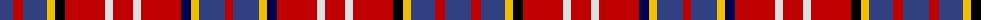

The parent of this is [Ogilvie 4](/tartans/b/26/r10/b24/y8/k10/r40/ln8/r20/ln8/r40/db10/y8/b26/r/8/)

This was sourced from weddslist.  It is a [14 stripes tartan](/stripes/stripes14/).

Original link http://www.weddslist.com/cgi-bin/tartans/pg.pl?source=sts

## Thread count
B/26 R10 B24 Y8 K10 R40 LN8 R20 LN8 R40 DB10 Y8 B26 R/8

## Palette
Each colour and its ΔE from the base-6 reference it is a variant of.

| Colour | Shade | Base | ΔE (OKLab) |
|---|---|---|---|
| B |  `#304080` | B  | 0.01 |
| DB |  `#000050` | B  | 0.20 |
| K |  `#000000` | K  | 0.00 |
| LN |  `#E0E0E0` | W  | 0.06 |
| R |  `#C00000` | R  | 0.02 |
| Y |  `#F0C000` | Y  | 0.01 |

ID: /variants/b/26/r10/b24/y8/k10/r40/ln8/r20/ln8/r40/db10/y8/b26/r/8-b304080-db000050-k000000-lne0e0e0-rc00000-yf0c000/
