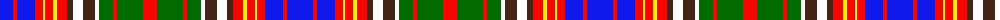

The parent of this is [Riley-Utter Union (Personal)](/tartans/b/26/r4/b18/r8/y2/r8/y4/r10/t6/w10/t12/w4/g14/r4/g26/r/14/)

This was sourced from register-of-tartans.  It is a [16 stripes tartan](/stripes/stripes16/).

Original link https://www.tartanregister.gov.uk/tartanDetails.aspx?ref=10842

## Thread count
B/26 R4 B18 R8 Y2 R8 Y4 R10 T6 W10 T12 W4 G14 R4 G26 R/14

## Palette
Each colour and its ΔE from the base-6 reference it is a variant of.

| Colour | Shade | Base | ΔE (OKLab) |
|---|---|---|---|
| B |  `#0F19EB` | B  | 0.17 |
| G |  `#026B00` | G  | 0.02 |
| R |  `#F50600` | R  | 0.09 |
| T |  `#442415` | B  | 0.19 |
| W |  `#FFFFFF` | W  | 0.03 |
| Y |  `#F0F000` | Y  | 0.12 |

ID: /variants/b/26/r4/b18/r8/y2/r8/y4/r10/t6/w10/t12/w4/g14/r4/g26/r/14-b0f19eb-g026b00-rf50600-t442415-wffffff-yf0f000/
