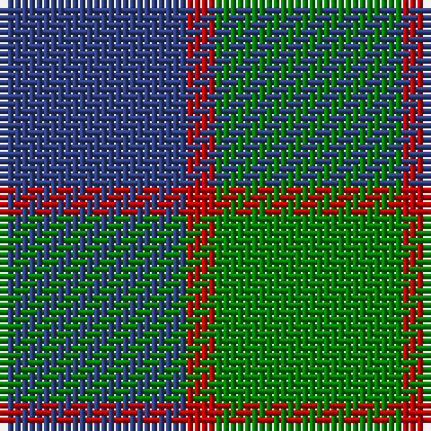

The parent of this is [Wilson's No 62, (Ferguson)](/tartans/b/26/r4/g/26/)

This was sourced from weddslist.  It is a [3 stripes tartan](/stripes/stripes3/).

Original link http://www.weddslist.com/cgi-bin/tartans/pg.pl?source=sts

## Thread count
B/26 R4 G/26

## Palette
Each colour and its ΔE from the base-6 reference it is a variant of.

| Colour | Shade | Base | ΔE (OKLab) |
|---|---|---|---|
| B |  `#304080` | B  | 0.01 |
| G |  `#008000` | G  | 0.09 |
| R |  `#C00000` | R  | 0.02 |

# Sample pattern

ID: /variants/b/26/r4/g/26-b304080-g008000-rc00000/
