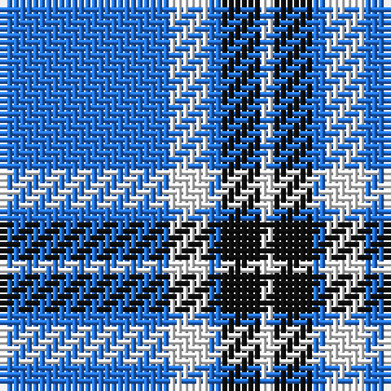

The parent of this is [Loch Lomond #2](/tartans/b/26/w6/b2/k6/w/2/)

This was sourced from register-of-tartans.  It is a [5 stripes tartan](/stripes/stripes5/).

Original link https://www.tartanregister.gov.uk/tartanDetails.aspx?ref=2150

## Thread count
B/26 W6 B2 K6 W/2

## Palette
Each colour and its ΔE from the base-6 reference it is a variant of.

| Colour | Shade | Base | ΔE (OKLab) |
|---|---|---|---|
| B |  `#2474E8` | B  | 0.20 |
| K |  `#101010` | K  | 0.17 |
| W |  `#FCFCFC` | W  | 0.03 |

# Sample pattern

ID: /variants/b/26/w6/b2/k6/w/2-b2474e8-k101010-wfcfcfc/
