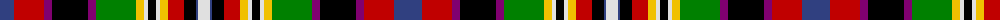

The parent of this is [Unidentified 4](/tartans/b/28/r30/p8/k36/p8/g40/y8/ln4/k8/ln4/y8/r16/k12/b2/ln/12/)

This was sourced from weddslist.  It is a [15 stripes tartan](/stripes/stripes15/).

Original link http://www.weddslist.com/cgi-bin/tartans/pg.pl?source=sts

## Thread count
B/28 R30 P8 K36 P8 G40 Y8 LN4 K8 LN4 Y8 R16 K12 B2 LN/12

## Palette
Each colour and its ΔE from the base-6 reference it is a variant of.

| Colour | Shade | Base | ΔE (OKLab) |
|---|---|---|---|
| B |  `#304080` | B  | 0.01 |
| G |  `#008000` | G  | 0.09 |
| K |  `#000000` | K  | 0.00 |
| LN |  `#E0E0E0` | W  | 0.06 |
| P |  `#800070` | B  | 0.17 |
| R |  `#C00000` | R  | 0.02 |
| Y |  `#F0C000` | Y  | 0.01 |

ID: /variants/b/28/r30/p8/k36/p8/g40/y8/ln4/k8/ln4/y8/r16/k12/b2/ln/12-b304080-g008000-k000000-lne0e0e0-p800070-rc00000-yf0c000/
