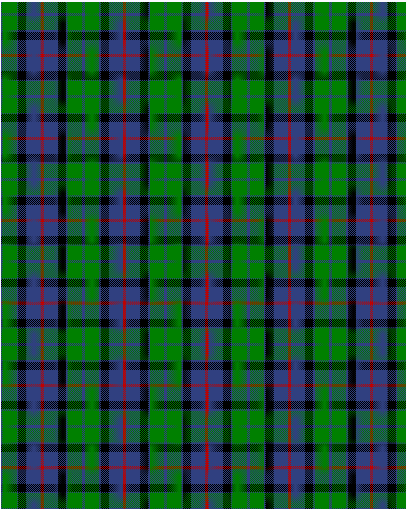

Flower of Scotland

This was sourced from <no value>.  It is a 6 stripes tartan.

Original link http://www.weddslist.com/cgi-bin/tartans/pg.pl?source=sts

## Thread count
B/3 G28 B3 K16 B28 R/3

## Palette
B#304080 G#008000 K#000000 R#C00000

# Sample pattern

ID: /variants/b/3/g28/b3/k16/b28/r/3-b304080-g008000-k000000-rc00000