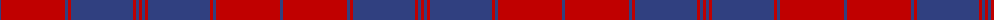
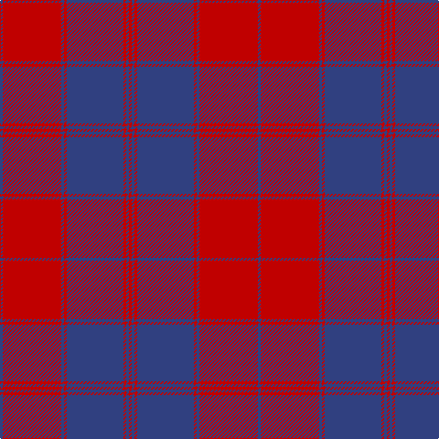

The parent of this is [Unidentified Plaid 8](/tartans/b/3/r64/b3/r3/b62/r3/b3/r/3/)

This was sourced from weddslist.  It is a [8 stripes tartan](/stripes/stripes8/).

Original link http://www.weddslist.com/cgi-bin/tartans/pg.pl?source=sts

## Thread count
B/3 R64 B3 R3 B62 R3 B3 R/3

## Palette
Each colour and its ΔE from the base-6 reference it is a variant of.

| Colour | Shade | Base | ΔE (OKLab) |
|---|---|---|---|
| B |  `#304080` | B  | 0.01 |
| R |  `#C00000` | R  | 0.02 |

# Sample pattern

ID: /variants/b/3/r64/b3/r3/b62/r3/b3/r/3-b304080-rc00000/
