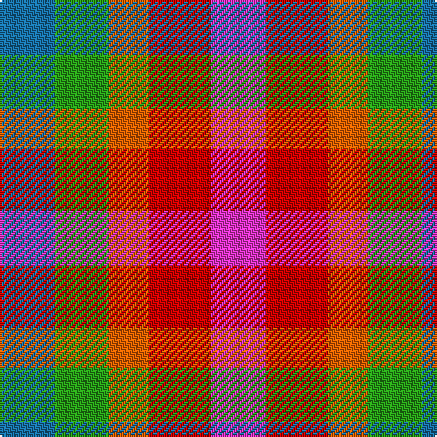

The parent of this is [Highland Princess, The](/tartans/b/30/g30/o22/r34/lr/30/)

This was sourced from register-of-tartans.  It is a [5 stripes tartan](/stripes/stripes5/).

Original link https://www.tartanregister.gov.uk/tartanDetails.aspx?ref=11009

## Thread count
B/30 G30 O22 R34 LR/30

## Palette
Each colour and its ΔE from the base-6 reference it is a variant of.

| Colour | Shade | Base | ΔE (OKLab) |
|---|---|---|---|
| B |  `#1870A4` | B  | 0.14 |
| G |  `#289C18` | G  | 0.18 |
| LR |  `#EC34C4` | R  | 0.24 |
| O |  `#E86000` | R  | 0.14 |
| R |  `#C80000` | R  | 0.00 |

# Sample pattern

ID: /variants/b/30/g30/o22/r34/lr/30-b1870a4-g289c18-lrec34c4-oe86000-rc80000/
