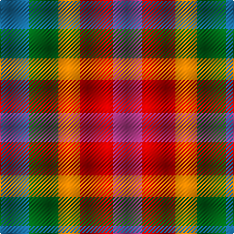

The parent of this is [Highland Princess, The](/tartans/b/30/g30/o22/r34/p/30/)

This was sourced from tartans-authority.  It is a [5 stripes tartan](/stripes/stripes5/).

Original link http://www.tartansauthority.com/tartan-ferret/display/11009/

## Thread count
B/30 G30 O22 R34 P/30

## Palette
Each colour and its ΔE from the base-6 reference it is a variant of.

| Colour | Shade | Base | ΔE (OKLab) |
|---|---|---|---|
| B |  `#1870A4` | B  | 0.14 |
| G |  `#006818` | G  | 0.02 |
| O |  `#D87C00` | Y  | 0.17 |
| P |  `#C04094` | R  | 0.17 |
| R |  `#C80000` | R  | 0.00 |

# Sample pattern

ID: /variants/b/30/g30/o22/r34/p/30-b1870a4-g006818-od87c00-pc04094-rc80000/
