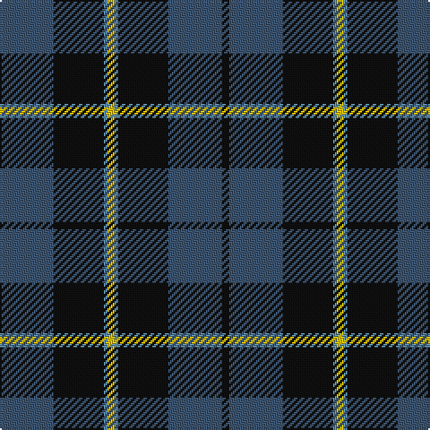

The parent of this is [South African Air Force](/tartans/b/30/k28/ba2/y4/ba2/k28/b30/k/4/)

This was sourced from register-of-tartans.  It is a [8 stripes tartan](/stripes/stripes8/).

Original link https://www.tartanregister.gov.uk/tartanDetails.aspx?ref=3840

## Thread count
B/30 K28 Ba2 Y4 Ba2 K28 B30 K/4

## Palette
Each colour and its ΔE from the base-6 reference it is a variant of.

| Colour | Shade | Base | ΔE (OKLab) |
|---|---|---|---|
| B |  `#3C5470` | B  | 0.08 |
| Ba |  `#5C8CA8` | B  | 0.23 |
| DB |  `#1C0070` | B  | 0.14 |
| DY |  `#D09800` | Y  | 0.11 |
| K |  `#101010` | K  | 0.17 |
| LB |  `#98C8E8` | W  | 0.17 |
| Y |  `#E8C000` | Y  | 0.00 |

# Sample pattern

ID: /variants/b/30/k28/ba2/y4/ba2/k28/b30/k/4-b3c5470-ba5c8ca8-db1c0070-dyd09800-k101010-lb98c8e8-ye8c000/
