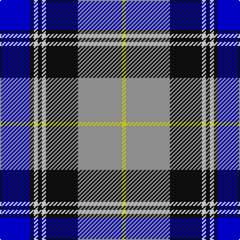

The parent of this is [Sneddon, Jonathan Taylor (Personal)](/tartans/b/30/k4/w4/k4/w4/k32/n44/y/4/)

This was sourced from register-of-tartans.  It is a [8 stripes tartan](/stripes/stripes8/).

Original link https://www.tartanregister.gov.uk/tartanDetails.aspx?ref=11519

## Thread count
B/30 K4 W4 K4 W4 K32 N44 Y/4

## Palette
Each colour and its ΔE from the base-6 reference it is a variant of.

| Colour | Shade | Base | ΔE (OKLab) |
|---|---|---|---|
| B |  `#0000FF` | B  | 0.21 |
| K |  `#101010` | K  | 0.17 |
| N |  `#A0A0A0` | Y  | 0.20 |
| W |  `#FFFFFF` | W  | 0.03 |
| Y |  `#FFFF00` | Y  | 0.16 |

# Sample pattern

ID: /variants/b/30/k4/w4/k4/w4/k32/n44/y/4-b0000ff-k101010-na0a0a0-wffffff-yffff00/
