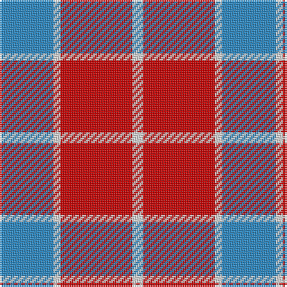

The parent of this is [Masai Shuka 24 (Artefact)](/tartans/b/30/ln4/r40/ln/6/)

This was sourced from tartans-authority.  It is a [4 stripes tartan](/stripes/stripes4/).

Original link http://www.tartansauthority.com/tartan-ferret/display/7284/

## Thread count
B/30 LN4 R40 LN/6

## Palette
Each colour and its ΔE from the base-6 reference it is a variant of.

| Colour | Shade | Base | ΔE (OKLab) |
|---|---|---|---|
| B |  `#2888C4` | B  | 0.21 |
| LN |  `#E0E0E0` | W  | 0.06 |
| R |  `#C80000` | R  | 0.00 |

# Sample pattern

ID: /variants/b/30/ln4/r40/ln/6-b2888c4-lne0e0e0-rc80000/
