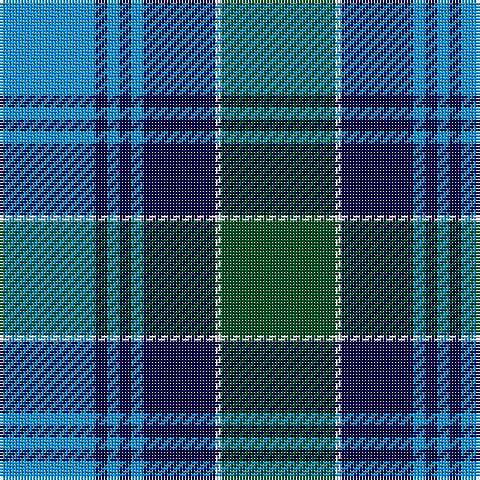

The parent of this is [Unidentified No 52](/tartans/b/32/db4/b4/db4/b4/db24/ln2/g/38/)

This was sourced from register-of-tartans.  It is a [8 stripes tartan](/stripes/stripes8/).

Original link https://www.tartanregister.gov.uk/tartanDetails.aspx?ref=4327

## Thread count
B/32 DB4 B4 DB4 B4 DB24 LN2 G/38

## Palette
Each colour and its ΔE from the base-6 reference it is a variant of.

| Colour | Shade | Base | ΔE (OKLab) |
|---|---|---|---|
| B |  `#0596FA` | B  | 0.28 |
| DB |  `#080848` | B  | 0.19 |
| G |  `#005020` | G  | 0.08 |
| LN |  `#E0E0E0` | W  | 0.06 |

# Sample pattern

ID: /variants/b/32/db4/b4/db4/b4/db24/ln2/g/38-b0596fa-db080848-g005020-lne0e0e0/
