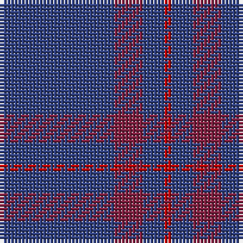

The parent of this is [Elliot](/tartans/b/32/dr8/b6/r/2/)

This was sourced from weddslist.  It is a [4 stripes tartan](/stripes/stripes4/).

Original link http://www.weddslist.com/cgi-bin/tartans/pg.pl?source=sts

## Thread count
B/32 DR8 B6 R/2

## Palette
Each colour and its ΔE from the base-6 reference it is a variant of.

| Colour | Shade | Base | ΔE (OKLab) |
|---|---|---|---|
| B |  `#304080` | B  | 0.01 |
| DR |  `#802040` | R  | 0.16 |
| R |  `#C00000` | R  | 0.02 |

# Sample pattern

ID: /variants/b/32/dr8/b6/r/2-b304080-dr802040-rc00000/
